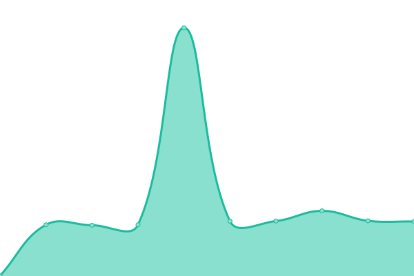
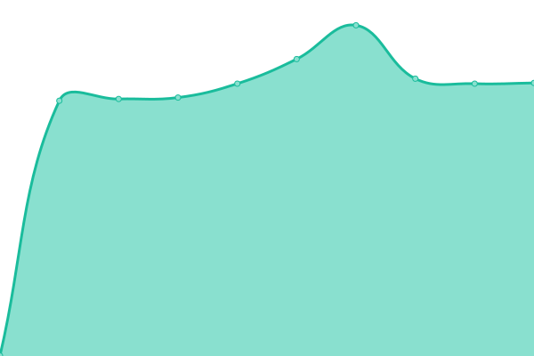
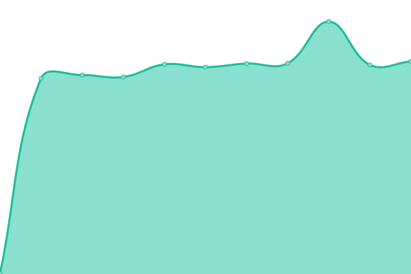
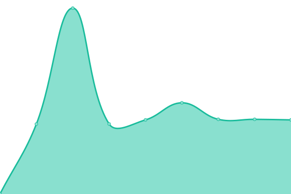
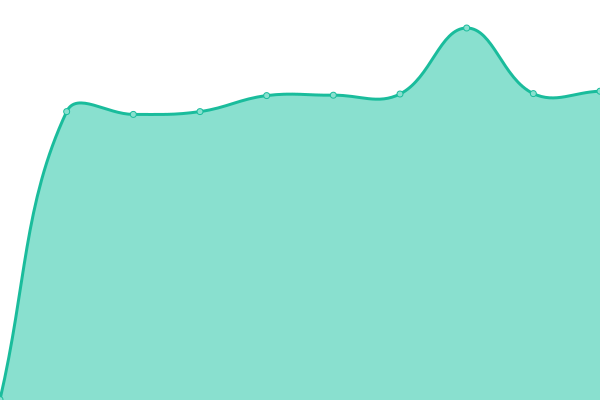

# [📈 Live Status](https://status.luke.casa): <!--live status--> **🟧 Partial outage**

This repository contains the open-source uptime monitor and status page for [status](https://status.luke.casa), powered by [Upptime](https://github.com/upptime/upptime).

With [Upptime](https://upptime.js.org), you can get your own unlimited and free uptime monitor and status page, powered entirely by a GitHub repository. We use [Issues](https://github.com/status/upptime/issues) as incident reports, [Actions](https://github.com/status/upptime/actions) as uptime monitors, and [Pages](https://status.luke.casa) for the status page.

<!--start: status pages-->
<!-- This summary is generated by Upptime (https://github.com/upptime/upptime) -->
<!-- Do not edit this manually, your changes will be overwritten -->
<!-- prettier-ignore -->
| URL | Status | History | Response Time | Uptime |
| --- | ------ | ------- | ------------- | ------ |
|  EM-X | 🟩 Up | [em-x.yml](https://github.com/amokster88/status/commits/HEAD/history/em-x.yml) | 

 435ms
     
 | 

<a href="https://status.luke.casa/history/em-x">100.00%</a>
    

|  ANDROMEDA | 🟩 Up | [andromeda.yml](https://github.com/amokster88/status/commits/HEAD/history/andromeda.yml) | 

 651ms
     
 | 

<a href="https://status.luke.casa/history/andromeda">100.00%</a>
    

|  CASSIOPEIA | 🟩 Up | [cassiopeia.yml](https://github.com/amokster88/status/commits/HEAD/history/cassiopeia.yml) | 

 682ms
     
 | 

<a href="https://status.luke.casa/history/cassiopeia">100.00%</a>
    

|  COMET | 🟩 Up | [comet.yml](https://github.com/amokster88/status/commits/HEAD/history/comet.yml) | 

 672ms
     
 | 

<a href="https://status.luke.casa/history/comet">100.00%</a>
    

|  EON | 🟥 Down | [eon.yml](https://github.com/amokster88/status/commits/HEAD/history/eon.yml) | 

 765ms
     
 | 

<a href="https://status.luke.casa/history/eon">100.00%</a>
    

|  NEBULON | 🟩 Up | [nebulon.yml](https://github.com/amokster88/status/commits/HEAD/history/nebulon.yml) | 

 670ms
     
 | 

<a href="https://status.luke.casa/history/nebulon">100.00%</a>
    

<!--end: status pages-->

[**Visit our status website →**](https://status.luke.casa)

## 📄 License

- Powered by: [Upptime](https://github.com/upptime/upptime)
- Code: [MIT](./LICENSE) © [Anand Chowdhary](https://anandchowdhary.com), supported by [Pabio](https://pabio.com)
- Data in the `./history` directory: [Open Database License](https://opendatacommons.org/licenses/odbl/1-0/)
